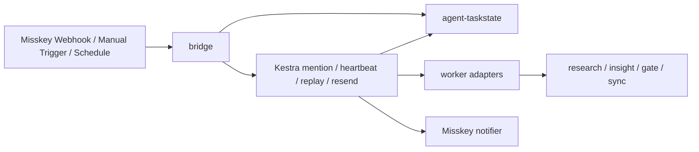

# pulse-kestra Specification

## 0. 文書情報

- 文書種別: specification
- 状態: active
- 対象: `bridge/`, `kestra/flows/`, `docs/`
- 対応要求: [requirements.md](requirements.md)

## 1. 位置づけ

本書は `pulse-kestra` の現状実装を正本として、制御面の責務、flow 契約、taskstate 契約、dedupe 契約、観測点を定義する。

参照順:

- [architecture.md](architecture.md)
- [requirements.md](requirements.md)
- [event-schema.md](event-schema.md)
- [runbook.md](runbook.md)

## 2. システム構成

## 2.1 正規チェーン

通常運転の正規経路は `research -> insight -> gate -> sync -> notify` とする。

- `pulse-kestra` はこのチェーンの入口、再送、再実行、重複抑止を担う。
- heartbeat は軽量巡回に限定し、重い worker を直接持たない。
- manual replay は途中 stage から再開可能とする。
- `agent-taskstate` は run / state / decision の正本とする。

## 3. コンポーネント仕様

### 3.1 bridge

bridge は次を担う。

- Misskey webhook の受信
- secret 検証
- 入力 guard
- `EventEnvelope` 生成
- `agent-taskstate` への task 起票
- Kestra webhook trigger 呼び出し
- note 起票時の durable dedupe

bridge は長時間 worker 処理を持たず、HTTP 応答を短く保つ。

### 3.2 Kestra flows

現行の主要 flow は次の 4 本である。

- `mention.yaml`
- `heartbeat.yaml`
- `manual-replay.yaml`
- `notifier-resend.yaml`

各 flow は共通して `taskstate_cli_path`, `taskstate_db`, `kestra_base_url` を globals で受け取り、公開向け既定値として相対パス sample を持つ。

### 3.3 taskstate gateway

`bridge/src/bridge/services/taskstate_gateway.py` は CLI の薄い wrapper として以下を提供する。

- task 作成
- state put
- status update
- task field update
- `idempotency_key` 検索
- `kestra_execution_id` 保存
- duplicate suppression 記録
- note / reply / replay の dedupe key 生成

## 4. Flow 仕様

### 4.1 mention flow

1. bridge が `misskey:{note_id}` で重複検知する。
2. 新規 task を作成し、`trace_id`, `reply_state`, `retry_count`, `roadmap_request_json` を保存する。
3. task を `ready` にし、Kestra mention flow を起動する。
4. mention flow は worker を実行し、結果を `reply_text` と taskstate に反映する。
5. notifier が Misskey へ返信し、成功時は `reply_state=sent`、失敗時は `reply_state=failed` を保存する。

### 4.2 heartbeat flow

heartbeat flow の責務は軽量巡回に限定する。

- stuck task 検出
- `reply_state=pending|failed` の再送候補検出
- `status=review` かつ `retry_count < max_retry_count` の replay 候補検出
- `manual-replay` と `notifier-resend` の起動
- 集計用 metrics の出力

heartbeat は worker 本体処理を直接実行しない。

### 4.3 manual replay flow

manual replay flow は `task_id` または `trace_id` を受け取り、元 task を解決する。

- `reply_text` と `roadmap_request_json` を元 task から再利用する
- `replay_dedupe_key` により短時間重複 replay を抑止する
- `replay_type=full|worker_only|notifier_only` を扱う
- 新規 replay task 作成時に `original_task_id`, `retry_count+1`, `reply_target`, `reply_state=pending` を保持する
- duplicate suppression 時は新規 task を作らず、元 task に suppression metadata を追記する

### 4.4 notifier resend flow

notifier resend flow は保存済み `reply_text` を再利用して Misskey 投稿だけをやり直す。

- `reply_dedupe_key` による duplicate suppression を扱う
- `reply_state=sent` の task は suppression 扱いで worker 再実行なし
- 失敗時は `reply_state=failed`, `retry_count+1`
- 成功時は `reply_state=sent`, `last_reply_dedupe_key` を保存する

## 5. Taskstate 契約

### 5.1 必須 field

現在の制御面が再利用する field は次の通り。

- `task_id`
- `status`
- `trace_id`
- `idempotency_key`
- `retry_count`
- `reply_state`
- `note_id`
- `reply_target`
- `reply_text`
- `roadmap_request_json`
- `original_task_id`
- `kestra_execution_id`

### 5.2 制御面拡張 field

運用観測と dedupe のため、次の field を使う。

- `duplicate_suppression_count`
- `last_duplicate_scope`
- `last_duplicate_key`
- `last_replay_dedupe_key`
- `last_reply_dedupe_key`

### 5.3 状態遷移

現行の flow では taskstate の status を次で扱う。

- `draft`
- `ready`
- `in_progress`
- `review`
- `done`
- `failed`

reply 状態は次を使う。

- `pending`
- `sent`
- `failed`
- `skipped`

## 6. Dedupe 仕様

durable dedupe の正本キーは以下とする。

- note 起票: `misskey:{note_id}`
- reply 送信: `reply:{task_id}:{reply_target}`
- replay 実行: `replay:{original_task_id}:{replay_type}:{bucket}`

### 6.1 note dedupe

- bridge が webhook 受信時に `find_by_idempotency_key()` で検索する
- 既存 task が `done`, `ready`, `in_progress` の場合は duplicate suppression として 204 を返す
- suppression 時は `duplicate_suppression_count` と `last_duplicate_*` を更新する

### 6.2 reply dedupe

- notifier resend は `reply_state=sent` を suppression 条件とする
- suppression 時は `duplicate_suppression_count` を増やし、`last_duplicate_scope=reply` を保存する

### 6.3 replay dedupe

- manual replay は `replay_dedupe_key` を元 task に保存して短時間重複を抑止する
- suppression 時は新規 replay task を作らない

## 7. 観測点

ダッシュボードは対象外だが、後から集計できる最小観測点は固定する。

- 日次 run 数
- `ok / degraded / failed` 件数
- replay 実行件数
- 未通知再送件数
- notification failure 件数
- tracker sync failure 件数
- duplicate suppression 件数

集計元は次とする。

- taskstate の `retry_count`, `reply_state`, `duplicate_suppression_count`
- heartbeat flow の `heartbeat_metrics.json`
- manual replay flow の `new_task.json`, `finalize_result.json`
- notifier resend flow の `resend_result.json`, `taskstate_update.json`

## 8. 公開向け既定値

Kestra flow の公開向け既定値は次とする。

- `taskstate_cli_path`: `./agent-taskstate_cli.py`
- `taskstate_db`: `./state/agent-taskstate.db`
- `roadmap_design_skill_path`: `./Roadmap-Design-Skill`
- `kestra_base_url`: `http://localhost:8080`

作者ローカル固有の絶対パスは flow 正本に含めない。

## 9. テスト戦略

最低限の回帰対象は次とする。

- bridge の webhook 受信と guard
- dedupe key 生成と duplicate suppression 記録
- heartbeat / manual replay / notifier resend の flow テキスト契約
- `task_id` / `trace_id` の両 replay 導線
- 公開向け既定値にローカル絶対パスが残っていないこと

## 10. 残留事項

- 複数 worker chaining の本実装は未完了
- 本仕様は現状の CLI / flow 契約を正本とし、将来の plugin 化は含めない
